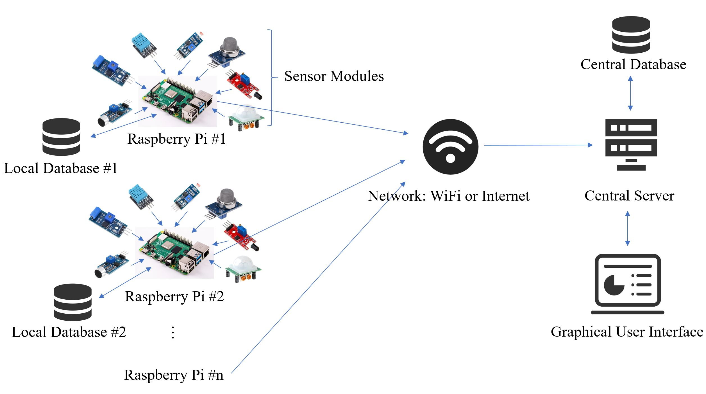
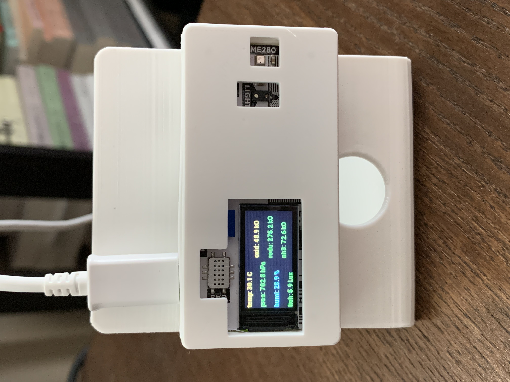
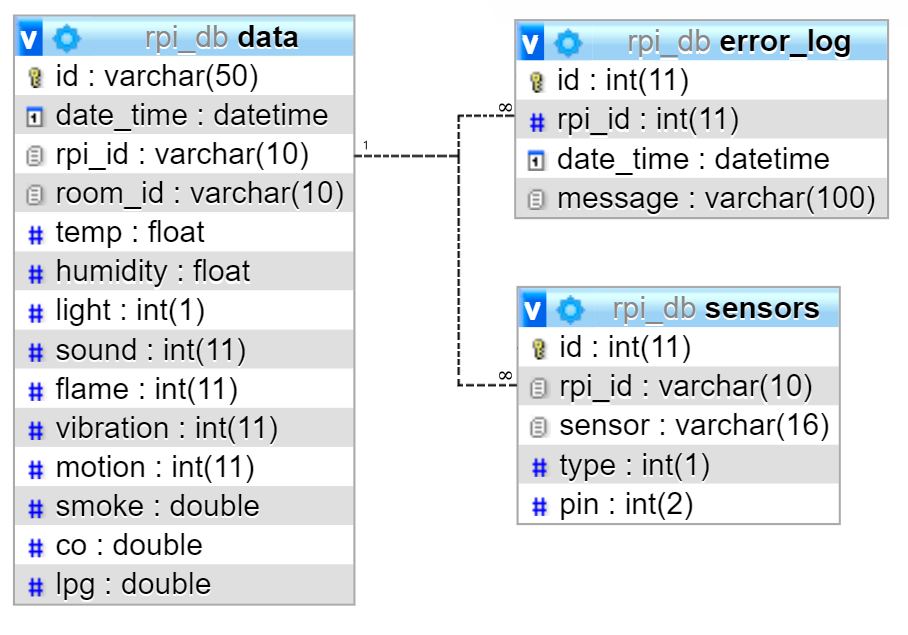
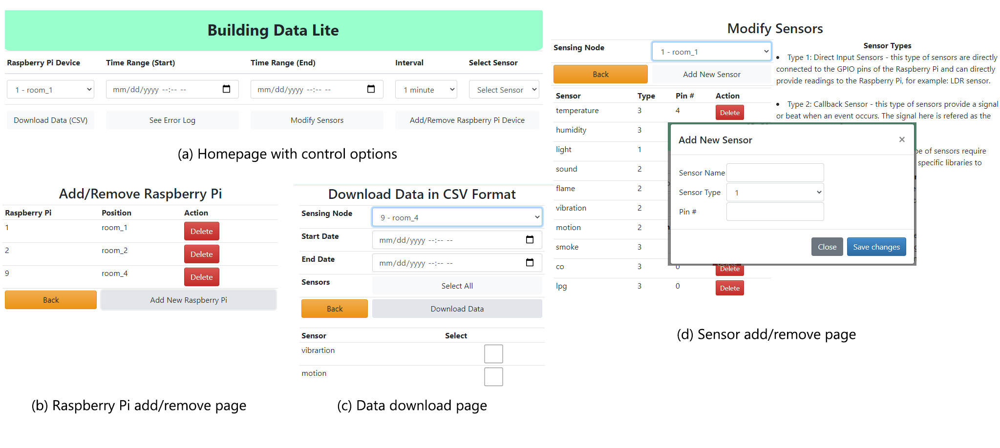
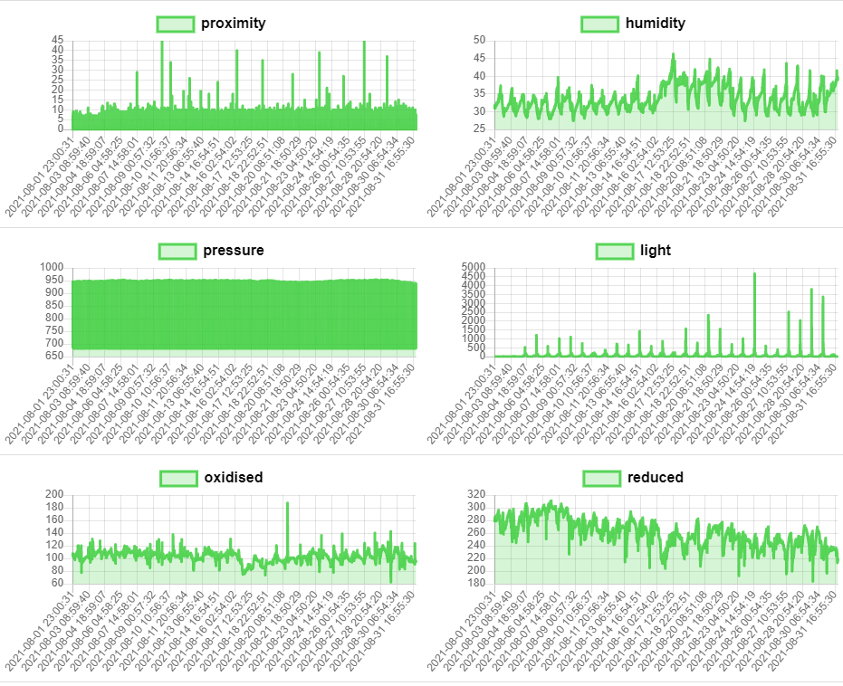

# Building Data Lite: A cost-effective, scalable, and portable IoT data infrastructure for indoor environment sensing

A multitude of building management systems, home automation systems, and the rapidly growing number of Internet of Things (IoT) devices highly rely on environmental monitoring. The use of indoor environmental data can significantly enhance the building performance and improve the living and working experiences of occupants. Nonetheless, such data are in short supply primarily because the existing technologies for facility monitoring are costly and often limited to specific building systems.

To address the problem of limited availability of indoor environment data, [Dr. Ray Gao](http://www.raygaoai.com/) (Xinghua), [Sheik Murad Hassan Anik](https://www.linkedin.com/in/anik801/), and [Dr. Na Meng](https://people.cs.vt.edu/nm8247/) at Virginia Polytechnic Institute and State University (Virginia Tech) developed a prototype of a cost-efficient, distributed, scalable, and portable indoor environmental data gathering system named [Building Data Lite (BDL)](https://building-data-lite.com/). BDL is built on Raspberry Pi computers and a diverse array of sensors such as those for temperature, humidity, light, motion, sound, vibration, and various gas types. The system comprises a distributed sensing network and a centralized server, which offers a web-based graphical user interface allowing users to access the gathered data online.

Published research article: [A cost-effective, scalable, and portable IoT data infrastructure for indoor environment sensing](papers/BDL.pdf)

Dr. Gao’s work in this project is under an umbrella research program [Internet of Things Enabled Data Acquisition Framework for Smart Building Applications](https://github.com/XinghuaGao/IoT-building-data#internet-of-things-enabled-data-acquisition-framework-for-smart-building-applications), which is initiated by Dr. Gao.

## System Design

The BDL system is composed of a central server and numerous customizable sensing nodes, each constructed around Raspberry Pi. The sensors within each node collect real-time environmental data and relay this information to the connected Raspberry Pi, which maintains its own local database. After a specific time period, the Raspberry Pi syncs with the central server and uploads the fresh data to the central database. The graphical user interface (GUI) interacts with the central database to visualize data. Additionally, it offers features like downloading selected data or the error log, and modifying the system by adding or removing sensing modules or nodes.

The BDL's central server is designed as a web-based system. The prototype employs PHP v7 as its server language. The front end is developed in HTML, CSS, and JavaScript. To create a swift and dynamic GUI, the system is designed to use Asynchronous JavaScript and XML (AJAX). For data visualization, JQuery and Chart.js libraries are utilized. The GUI retrieves data from the central database. The server is actively hosted on third-party hosting sites under the domain: [building-data-lite.com](http://building-data-lite.com/).

The BDL system incorporates two distinct database designs. One design is employed in the sensing nodes, while the other is utilized in the central server. Both databases share common entities like "error_logs" and "sensors". In the local database, the "data_storage" table corresponds to a specific Raspberry Pi table in the central database named "rpi_n", where "n" represents the identification number of the Raspberry Pi.

The BDL system's GUI offers five functions to users. These functions include data visualization, data download, error log download, the ability to add or remove sensing nodes (Raspberry Pis), and the option to modify sensor modules on each sensing node. Users can utilize the GUI to access these features and interact with the system effectively.

## **Source Code and Sample Data (H2)**

[rpi_code](rpi_code) contains the code that runs on the Raspberry Pi (we tested Raspberry Pi 4 model B and Raspberry Pi Zero; operating system: Raspberry Pi OS).

[server_code/data_collection](server_code/data_collection) contains the code that runs on the server.

[sample_data](sample_data) contains some sample data collected by one deployed device of the BDL system.

## **Project Team and Contributors (H2)**

[Dr. Ray Gao](http://www.raygaoai.com/)

[Sheik Murad Hassan Anik (soon to be PhD)](https://www.linkedin.com/in/anik801/)

[Dr. Na Meng](https://people.cs.vt.edu/nm8247/)

[Dr. Philip Agee](https://www.bc.vt.edu/people/agee)

[Dr. Andrew McCoy](https://www.bc.vt.edu/people/mccoy)

[Dr. Angelos Stavrou](https://computing.ece.vt.edu/~angelos/)
